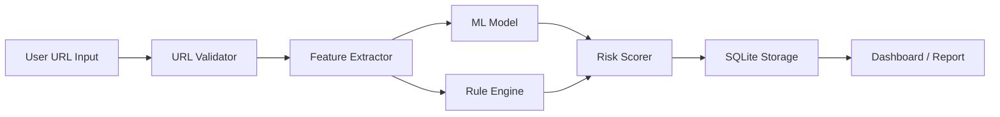

# Architecture

PhishGuard follows a simple pipeline: URL input -> validation/parsing -> feature extraction -> model and rule analysis -> risk scoring -> persistence/reporting.

```mermaid
flowchart LR
A[User URL Input] --> B[URL Validator] --> C[Feature Extractor] --> D[ML Model] --> E[Risk Scorer]
C --> F[Rule Engine] --> E
E --> G[SQLite Storage] --> H[Dashboard / Report]
```
